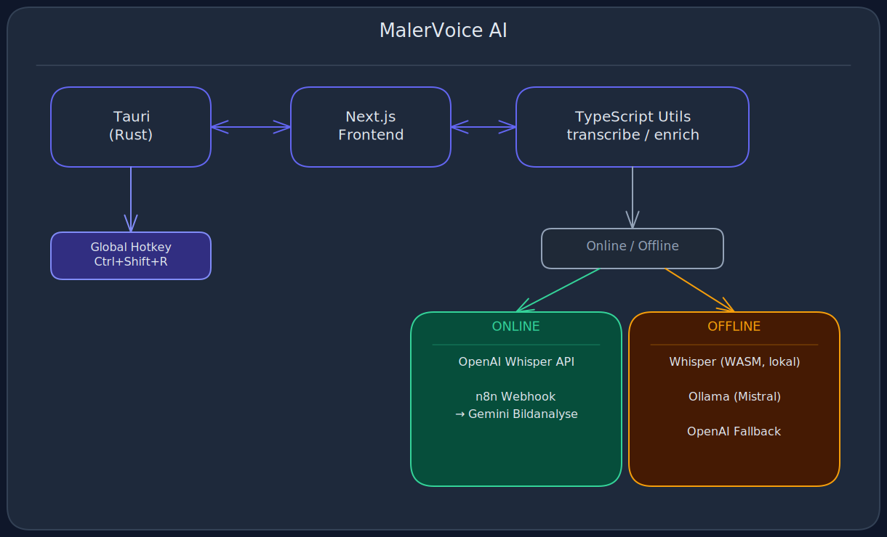
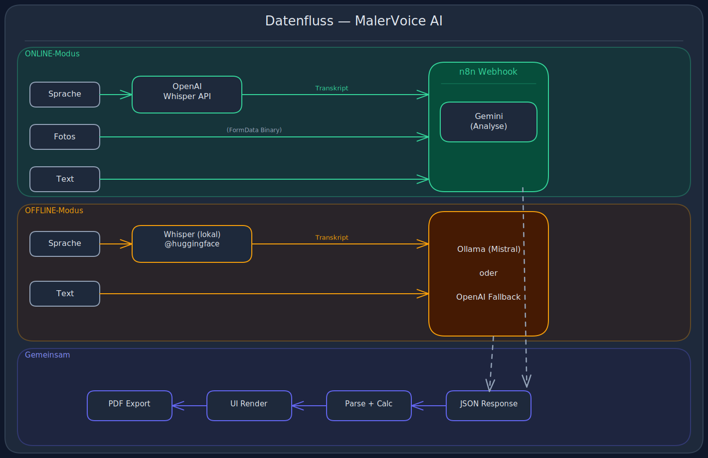

# 🎨 MalerVoice AI

**Intelligente Angebotserstellung für Maler – per Sprache und Text**

> 🏆 Eingereicht für den Developer Contest: Voice-to-Text Desktop App

---

## 🎯 Das Problem

**Maler und Handwerker verlieren täglich 1-2 Stunden mit Angebotserstellung.**

Der typische Ablauf heute:
1. Kunde anrufen / Vor-Ort-Termin
2. Notizen auf Papier oder Handy
3. Zurück ins Büro
4. Fotos durchschauen
5. Flächen berechnen
6. Preise nachschlagen
7. Angebot in Word/Excel tippen
8. PDF erstellen und versenden

**Das Ergebnis:** Fehleranfällig, zeitaufwändig, frustrierend.

---

## 💡 Die Lösung

**MalerVoice AI** transformiert den gesamten Prozess in einen einzigen, nahtlosen Workflow:

```
🎤 Sprache  +  📸 Fotos  +  📝 Text  →  🤖 KI (lokal oder Cloud)  →  📄 Fertiges Angebot
```

### So funktioniert's:

1. **Hotkey drücken** (`⌘⇧R`) – App ist sofort bereit
2. **Sprechen**: *"Wohnzimmer 25 Quadratmeter, Wände und Decke streichen, drei Fenster, Risse in der Südwand"*
3. **Optional**: Fotos vom Raum hinzufügen
4. **Ein Klick** → Vollständiges Angebot mit:
    - Detaillierten Positionen
    - Korrekten Preisen (nach Handwerksstandard)
    - Professioneller KI-Analyse
    - PDF-Export

**Zeitersparnis: 45-60 Minuten pro Angebot.**

---

## ✨ Features

| Feature | Beschreibung |
|---------|-------------|
| 🎤 **Voice-to-Text** | Online: OpenAI Whisper API · Offline: lokaler Whisper im Browser (WASM) |
| 📸 **Foto-Analyse** | Online: Bilder werden per n8n an Google Gemini gesendet für visuelle Kalkulation |
| ⌨️ **Global Hotkey** | `⌘⇧R` / `Ctrl+Shift+R` – funktioniert aus jeder Anwendung |
| 🤖 **KI-Enrichment** | Online: n8n + Gemini · Offline: Ollama (Mistral) mit OpenAI-Fallback |
| 🔄 **Online/Offline** | Ein Toggle wechselt zwischen Cloud- und lokal-Modus |
| 📄 **PDF-Export** | Professionelle Angebote, sofort versandfertig |
| 🌙 **Dark Mode UI** | Modernes, augenschonendes Design |

---

## 🏗️ Architektur



### Technologie-Stack

| Komponente | Technologie | Warum? |
|------------|-------------|--------|
| **Desktop Runtime** | Tauri 2.0 + Rust | Schnell, sicher, klein (~10MB vs ~150MB Electron) |
| **Framework** | Next.js 15 + React 19 | Statischer Export für Tauri, moderna Komponentenstruktur |
| **Voice (Offline)** | Whisper via @huggingface/transformers | Läuft lokal im Browser (WASM), keine API nötig |
| **Voice (Online)** | OpenAI Whisper API | Schnellere Transkription, kein lokaler Modell-Download |
| **Enrichment (Offline)** | Ollama (Mistral) | Lokales Modell, OpenAI-kompatibler API |
| **Enrichment (Online)** | n8n + Google Gemini | Bildanalyse via Gemini, orchestriert durch n8n-Workflow |
| **Fallback** | OpenAI GPT-4o | Backup wenn Ollama nicht verfügbar |
| **PDF-Generation** | jsPDF | Client-seitig, keine Server-Abhängigkeit |

---

## 🔄 Datenfluss



---

## 🧠 Woher kommt das Fachwissen?

Die App nutzt **keine vorab trainierten Handwerks-Modelle**. Stattdessen wird eine strukturierte **Preisliste 2025 (Deutschland)** als System-Prompt an die KI übergeben. Dies gewährleistet:

- ✅ **Volle Transparenz** — Jeder Preis ist nachvollziehbar
- ✅ **Anpassbarkeit** — Preise können jederzeit aktualisiert werden
- ✅ **Keine Black-Box** — Die gesamte Kalkulationslogik ist offen einsehbar

**Beispiel-Preise:**
- Wandanstrich weiß (2-fach): 12.50 €/m²
- Spachteln Q2: 18.00 €/m²
- Anfahrt (bis 30 km): 59.00 € pauschal

Die Prompts enthalten außerdem:
- Faustformeln für Flächenberechnungen
- Keyword-basierte Zustandserkennung ("Risse" → Spachteln erforderlich)
- Kalkulationsreihenfolge (Vorarbeiten → Untergrund → Anstrich → Zusatzkosten)

→ **[Vollständige Dokumentation der Wissensquelle](docs/WISSENSQUELLE.md)**

---

## 📦 Installation & Setup

### Voraussetzungen

- Node.js 18+
- Rust (via rustup)
- [Ollama](https://ollama.ai) installiert
- macOS / Windows / Linux

### 1. Repository klonen

```bash
git clone https://github.com/somuchlearn/Everlast-contest-maler-app.git
cd Everlast-contest-maler-app
```

### 2. Ollama-Modell pullen *(nur für Offline-Modus)*

```bash
ollama pull mistral
```

> Das Modell (~4GB) wird einmal heruntergeladen und lokal gespeichert. Ollama muss beim Betrieb im Hintergrund laufen. Im Online-Modus wird Ollama nicht benötigt.

### 3. Dependencies installieren

```bash
npm install
```

### 4. Environment konfigurieren (optional)

Erstelle `.env` im Root-Verzeichnis für den Cloud-Fallback:

```env
NEXT_PUBLIC_OPENAI_API_KEY=sk-your-openai-api-key
```

> Ohne diesen Key läuft die App trotzdem – solange Ollama lokal läuft, wird OpenAI nicht benötigt.

### 5. Development starten

```bash
npm run tauri dev
```

### 6. Production Build

```bash
npm run tauri build
```

Das Build-Artefakt liegt in `src-tauri/target/release/bundle/`.

> **Im Offline-Modus** wird beim ersten Umschalten das Whisper-Modell (~244MB) automatisch heruntergeladen und gecacht. Danach läuft die Transkription komplett ohne Internet.

---

## ⌨️ Bedienung

| Aktion | Shortcut / UI |
|--------|---------------|
| Online/Offline wechseln | Toggle-Schalter im Header (🖥️ ↔ ☁️) |
| App aktivieren | `⌘⇧R` (Mac) / `Ctrl+Shift+R` (Win/Linux) |
| Aufnahme starten | Button "🎙️ Aufnahme starten" oder Hotkey |
| Aufnahme stoppen | Button "Aufnahme stoppen" oder Hotkey erneut |
| Fotos hinzufügen | Drag & Drop oder Klick auf Upload-Zone |
| Angebot erstellen | Button "Angebot erstellen →" |
| PDF exportieren | Button "📄 PDF" im Ergebnis |
| Neues Angebot | Button "↺ Neu" |

---

## 🎨 Design-Entscheidungen

### 1. Warum Tauri statt Electron?

| Kriterium | Tauri | Electron |
|-----------|-------|----------|
| Bundle-Größe | ~10 MB | ~150 MB |
| RAM-Verbrauch | ~50 MB | ~300 MB |
| Startup-Zeit | <1s | 2-3s |
| Sicherheit | Rust-basiert | Chromium-basiert |

**Fazit:** Für eine App die "nahtlos im Workflow" sein soll, ist Performance entscheidend.

### 2. Warum Online/Offline-Toggle statt rein Cloud oder rein lokal?

Das Briefing fordert eine **"eigenständige Desktop-Applikation"** — das erfordert Funktionieren ohne Internet. Gleichzeitig bietet Cloud-KI konkrete Vorteile (Bildanalyse, Geschwindigkeit). Der Toggle gibt dem Nutzer die Kontrolle:

- **Offline-Modus:** Whisper läuft über `@huggingface/transformers` direkt im Browser (WASM). Enrichment per Ollama (Mistral) lokal. Falls Ollama nicht verfügbar → automatischer Fallback auf OpenAI GPT-4o.
- **Online-Modus:** Transkription über OpenAI Whisper API. Enrichment über n8n-Workflow mit Google Gemini — hier kommt die Bildanalyse ins Spiel (sieh Punkt 3).
- **Pragmatische Entscheidung:** Wer Ollama nicht installieren kann oder will, kann trotzdem die vollen Features nutzen – einfach auf Online bleiben.

### 3. Warum n8n + Google Gemini für Online-Enrichment?

Die Foto-Analyse war die technisch anspruchsvolste Anforderung. Optionen:

- **OpenAI Vision direkt:** Einfacher, aber kein Workflow-Management, kein Routing nach Medientyp.
- **n8n + Gemini (gewählt):** n8n orchestriert den gesamten Prozess — Routing nach `text_only` / `image_analysis` / `mixed_media`, unterschiedliche Gemini-Modelle je Komplexität (2.5 Pro für Text, 1.5 Pro für Multi-Modal). Die Bilder werden als `multipart/form-data` an den Webhook gesendet und landen direkt in n8n's Binary-Pipeline.

**Vorteil:** Der KI-Workflow kann unabhängig vom Frontend weiterentwickelt werden — neue Modelle, Prompts oder Routingregeln ändern sich nur auf der n8n-Seite.

### 4. Warum Ollama + Mistral?

- **OpenAI-kompatibler API:** Der gleiche Code arbeitet mit Ollama lokal und OpenAI als Fallback – minimale Duplikation.
- **Mistral:** Starkes Modell für Deutsch, verlässlich bei strukturierter JSON-Ausgabe.
- **Einfaches Setup:** Ein Befehl (`ollama pull mistral`), dann läuft es.

### 5. UI/UX Entscheidungen

- **Dark Mode:** Reduziert Augenbelastung bei längerer Nutzung
- **Minimalistisches Design:** Fokus auf Funktion, keine Ablenkung
- **Inline-Feedback:** Status, Transkript, Fehler direkt sichtbar
- **Model-Status-Indikator:** Zeigt ob das Whisper-Modell geladen ist

---

## 📊 Beispiel-Output

**Eingabe (Sprache):**
> "Schlafzimmer 18 Quadratmeter, Wände streichen weiß, Decke auch, ein Fenster, Tür, kleiner Riss an der Nordwand"

**Ausgabe:**

| Position | Menge | Einheit | Preis | Summe |
|----------|-------|---------|-------|-------|
| Abkleben Fenster, Tür | 2 | Stk | 4,50 € | 9,00 € |
| Risse ausbessern | 1 | Stk | 30,00 € | 30,00 € |
| Grundierung Wände | 48 | m² | 8,00 € | 384,00 € |
| Wandanstrich weiß 2-fach | 48 | m² | 14,00 € | 672,00 € |
| Deckenanstrich weiß | 18 | m² | 13,00 € | 234,00 € |
| **Netto** | | | | **1.329,00 €** |
| **MwSt. 19%** | | | | **252,51 €** |
| **Brutto** | | | | **1.581,51 €** |

---

## ⚠️ Known Issues & Security Considerations

### API-Key Exponierung (Client-Side)

**Problem:**
Die App nutzt `NEXT_PUBLIC_OPENAI_API_KEY` für den OpenAI-Fallback. Environment-Variablen mit dem `NEXT_PUBLIC_` Prefix werden in Next.js im Client-Bundle exponiert und können theoretisch aus dem JavaScript extrahiert werden.

**Risiko-Bewertung:**
- 🟡 **Mittel** — Betrifft nur den Fallback-Pfad (Ollama ist primär)
- User können die App vollständig ohne OpenAI-Key nutzen (Offline-Modus)
- Im Offline-Modus werden keine Cloud-APIs benötigt

**Best Practice Lösung:**
Für Production-Deployments sollten sensible API-Keys nicht im Client-Bundle landen. Empfohlene Ansätze:

1. **Tauri Command** (Desktop-Apps):
   ```rust
   #[tauri::command]
   fn get_api_key() -> Result<String, String> {
       std::env::var("OPENAI_API_KEY")
           .map_err(|_| "Key not configured".to_string())
   }
   ```
   Der Key liegt dann nur im Rust-Binary, nie im JavaScript.

2. **Backend-Proxy** (Web-Apps):
   ```
   Client → Next.js API Route → OpenAI
   ```
   API-Keys bleiben auf dem Server.

3. **Nur lokale Modelle** (Privacy-First):
   ```
   Ollama + Mistral (lokal) → Kein API-Key nötig
   ```

**Für dieses Projekt:**
Der OpenAI-Fallback ist bewusst optional gehalten. Der Offline-Modus (Hauptfeature) funktioniert komplett ohne Cloud-APIs und demonstriert die Desktop-App-Fähigkeiten für den Contest.

---

### n8n Webhook (Online-Modus)

**Implementierung:**
Der n8n-Webhook-Endpoint für die Online-Bildanalyse ist aus Sicherheitsgründen nicht im Repository hart-codiert. Stattdessen wird er über die Environment-Variable `NEXT_PUBLIC_N8N_WEBHOOK_URL` konfiguriert.

**Lokale Entwicklung:**
Siehe `.env.example` für Setup-Anleitung.

**Für Contest-Demo:**
Der Offline-Modus wird demonstriert (keine Cloud-Abhängigkeit, alle Features lokal verfügbar).

**Best Practice:**
Webhooks sollten entweder durch zufällige URLs, API-Key-Authentifizierung oder Request-Signing geschützt werden. Siehe `docs/SICHERHEIT.md` für Details.

---

## 🙏 Danksagungen

- [Tauri](https://tauri.app/) – Desktop-Framework
- [Next.js](https://nextjs.org/) – Web-Framework
- [@huggingface/transformers](https://github.com/huggingface/transformers.js) – Lokale Whisper-Inferenz im Browser
- [Ollama](https://ollama.ai/) – Lokale LLM-Ausführung
- [n8n](https://n8n.io/) – Workflow-Orchestrierung für Online-Enrichment
- [Google Gemini](https://ai.google/) – Cloud-KI für Text- und Bildanalyse
- [jsPDF](https://github.com/parallax/jsPDF) – Client-seitige PDF-Generierung

---

<div align="center">

**🎨 MalerVoice AI** – *Sprich dein Angebot.*

</div>
